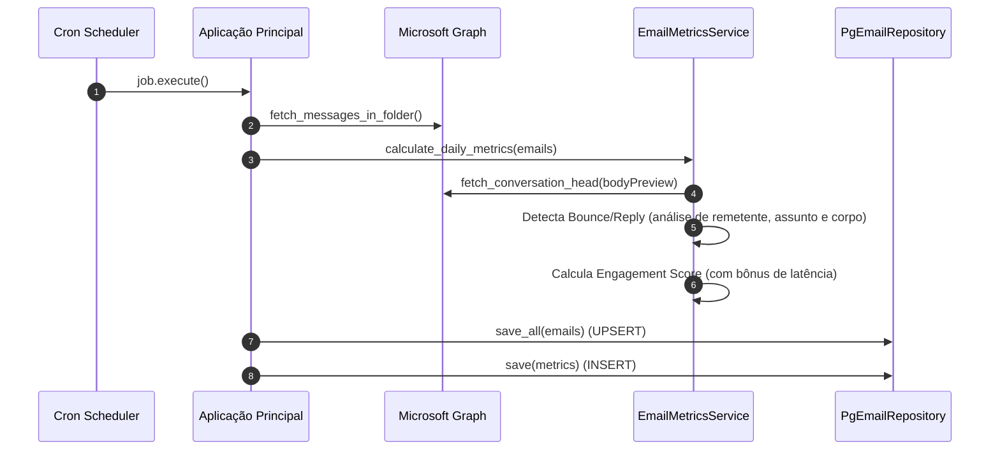

# Email-Metrics 📊

[](https://www.python.org/)
[](https://www.postgresql.org/)
[](https://learn.microsoft.com/graph)
[](https://github.com/metabase/metabase)
[](https://www.google.com/search?q=%23licen%C3%A7a)

> **Motor de análise de engajamento de e-mail.** Coleta e enriquece dados de campanhas via Microsoft Graph, calcula uma pontuação de engajamento detalhada e persiste em PostgreSQL, com logs estruturados e consultas prontas para dashboards em Metabase.

-----

## Índice

1.  [Visão Geral](https://www.google.com/search?q=%23vis%C3%A3o-geral)
2.  [Principais Métricas e Conceitos](https://www.google.com/search?q=%23principais-m%C3%A9tricas-e-conceitos)
3.  [Fluxo de Funcionamento](https://www.google.com/search?q=%23fluxo-de-funcionamento)
4.  [Modelo de Dados](https://www.google.com/search?q=%23modelo-de-dados)
5.  [Estrutura de Diretórios](https://www.google.com/search?q=%23estrutura-de-diret%C3%B3rios)
6.  [Variáveis de Ambiente](https://www.google.com/search?q=%23vari%C3%A1veis-de-ambiente)
7.  [Execução Rápida](https://www.google.com/search?q=%23execu%C3%A7%C3%A3o-r%C3%A1pida)
8.  [Consultas para Dashboards](https://www.google.com/search?q=%23consultas-para-dashboards)
9.  [Roadmap / TODO](https://www.google.com/search?q=%23roadmap--todo)
10. [Licença](https://www.google.com/search?q=%23licen%C3%A7a)

-----

## Visão Geral

| Componente | Responsabilidade |
| :--- | :--- |
| **`GraphApiClient`** | Consome a API do Microsoft Graph com paginação segura, retries e seleção eficiente de campos. |
| **`EmailMetricsService`** | **Cérebro do sistema.** Orquestra a análise de cada conversa para detectar interações (respostas, bounces) e calcula a **Pontuação de Engajamento** com base no resultado e na latência da resposta. |
| **`PgEmailRepository`** | Garante a persistência atômica e eficiente dos dados, com `UPSERT` para e-mails e `INSERT` append-only para as métricas diárias. |
| **Lógica Principal** | Orquestra o fluxo para múltiplas contas de e-mail de forma concorrente, garantindo alta performance. |
| **`Structlog`** | Gera logs em formato JSON, prontos para ingestão em plataformas de observabilidade como Loki, Datadog ou ELK. |
| **Metabase (Opcional)** | Ambiente de Business Intelligence pré-configurado via `docker-compose` para visualização dos dados. |

-----

## Principais Métricas e Conceitos

O sistema evoluiu de uma simples classificação para um modelo de pontuação mais sofisticado.

### 1\. Pontuação de Engajamento (`engagement_score`)

Cada conversa iniciada recebe uma pontuação para medir a qualidade da interação:

  * **`-100` (Frio):** Aconteceu um **bounce**. O e-mail não foi entregue.
  * **`0` (Morno):** O e-mail foi entregue com sucesso, mas **não houve resposta**.
  * **`+50` a `+70` (Quente):** O e-mail foi **respondido**. A pontuação base é `50`, com bônus por rapidez:
      * **+20 pontos** (total 70) para respostas em menos de 4 horas.
      * **+10 pontos** (total 60) para respostas em menos de 12 horas.
      * **+5 pontos** (total 55) para respostas em menos de 48 horas.

### 2\. Detecção Robusta de Interação

Para evitar falsos positivos, a detecção é multicamada:

  * **Bounce:** Identificado se o **remetente** for um sistema (`postmaster`, `microsoftexchange`, etc.) OU se o **assunto/corpo** do e-mail contiver termos de falha na entrega (`undeliverable`, `user doesn't exist`, etc.).
  * **Resposta:** Considerada genuína apenas se o **remetente for externo** E o **assunto não for um prefixo ignorado** (como `ENC:`, `FW:`, `Ausência Temporária:`), garantindo que encaminhamentos e respostas automáticas não sejam contados.

### 3\. Temperatura (Individual vs. Agregada)

  * **Temperatura Individual:** Cada e-mail no banco recebe um rótulo (`quente`, `morno`, `frio`) que é um reflexo direto de sua `engagement_score`.
  * **Temperatura da Campanha:** A métrica diária agregada recebe uma temperatura baseada na **taxa de resposta geral** do dia (ex: \>50% = quente), medindo a performance da campanha como um todo.

-----

## Fluxo de Funcionamento



-----

## Modelo de Dados

### Tabela `emails` (Dados por E-mail)

Armazena informações detalhadas sobre cada e-mail enviado e sua interação.

| Coluna | Tipo | Descrição |
| :--- | :--- | :--- |
| `id` | `uuid` (PK) | Identificador único do registro. |
| `account_id` | `uuid` (FK) | Conta que realizou o envio. |
| `conversation_id` | `text` | ID da thread de conversa do Microsoft Graph. |
| `is_bounced` | `boolean` | `True` se o e-mail sofreu bounce. |
| `is_replied` | `boolean` | `True` se o e-mail foi respondido por um humano. |
| `engagement_score`| `integer` | Pontuação de -100 a 70 baseada na interação. |
| `temperature_label`| `text` | Rótulo "quente", "morno" ou "frio" baseado na pontuação. |
| `reply_latency_sec`| `float` | Tempo em segundos entre o envio e a resposta. |

*Chave única da tabela: `(account_id, message_id, conversation_id)`.*

### Tabela `metrics` (Snapshot Diário)

Agrega os resultados de todas as contas para cada dia de operação.

| Coluna | Tipo | Descrição |
| :--- | :--- | :--- |
| `total_sent` | `integer` | Total de conversas iniciadas (sem `RES:`, `ENC:`, etc.). |
| `total_replied`| `integer` | Total de conversas respondidas. |
| `reply_rate` | `integer` | Taxa de resposta da campanha (x10000). |
| `avg_reply_latency_sec` | `float` | Média de tempo de resposta em segundos. |
| `temperature_label` | `text` | Temperatura geral da campanha baseada na `reply_rate`. |

-----

## Estrutura de Diretórios

```
.
├── adapters/          # Adaptações para tecnologias externas (Graph API, PostgreSQL)
├── application/       # Casos de uso e orquestração da lógica de negócio
├── domain/            # Entidades, regras de negócio e a lógica principal (coração do sistema)
├── ports/             # Interfaces (contratos) da Arquitetura Hexagonal
├── config/            # Configurações de ambiente, logging e settings
├── docs/              # Documentação e exemplos de queries SQL
├── infrastructure/    # Arquivos de infraestrutura (Dockerfile, docker-compose.yml)
└── tests/             # Testes unitários e de integração
```

-----

## Variáveis de Ambiente

| Chave | Exemplo / Descrição |
| :--- | :--- |
| **OAuth / Graph** | |
| `TENANT_ID`, `CLIENT_ID`, `CLIENT_SECRET` | Credenciais do App Registration no Azure AD. |
| `EMAIL_ACCOUNTS` | Lista de e-mails a serem monitorados, separados por vírgula. |
| **Filtros e Regras** | |
| `SUBJECT_FILTER` | `OPORTUNIDADE DE ACORDO,PROPOSTA DE ACORDO` (Processa apenas e-mails cujos assuntos contenham um destes termos). |
| `IGNORE_SUBJECT_PREFIXES` | `ENC,FW,RESPOSTA AUTOMÁTICA` (Prefixos de assunto que não são considerados respostas genuínas). |
| `SENT_FOLDER_NAME` | `Itens Enviados` (Nome da pasta de onde os e-mails são lidos). |
| **PostgreSQL** | |
| `POSTGRES_HOST/PORT/DB/USER/PASSWORD` | Credenciais de acesso ao banco de dados. |

-----

## Execução Rápida

### Docker Compose (Recomendado)

O `docker-compose.yml` orquestra a aplicação e um container do Metabase.

```bash
# 1. Crie e edite seu arquivo de ambiente
cp .env.example .env
nano .env

# 2. Suba os containers
docker compose up --build

# A aplicação começará a rodar.
# O Metabase estará disponível em http://localhost:3878
```

### Execução Local (Poetry)

```bash
# Instale as dependências
poetry install

# Execute o processo uma única vez
poetry run python -m application.main --once
```

-----

## Consultas para Dashboards

O sistema foi projetado para alimentar dashboards de BI. As queries abaixo são exemplos do que pode ser criado.

```sql
-- KPI: Ranking de Performance por Conta (últimos 30 dias)
-- Combina taxa de resposta e pontuação média para criar um índice de performance
SELECT
  a.email_address                                                                   AS "Conta",
  ROUND(100.0 * SUM(e.is_replied::int) / NULLIF(SUM((NOT e.is_bounced)::int), 0), 2) AS "Taxa de Resposta (%)",
  ROUND(AVG(e.engagement_score), 2)                                                 AS "Pontuação Média",
  ROUND((SUM(e.is_replied::int) / NULLIF(SUM((NOT e.is_bounced)::int), 0)) * AVG(e.engagement_score), 2) AS "Índice de Performance"
FROM
  public.emails e
JOIN
  public.accounts a ON a.id = e.account_id
WHERE
  e.sent_datetime >= CURRENT_DATE - INTERVAL '30 days'
GROUP BY
  a.email_address
ORDER BY
  "Índice de Performance" DESC;
```

> Veja a lista completa de 12 KPIs em [`docs/sql/metabase_examples.md`](./docs/sql/metabase_examples.md).

-----

## Roadmap / TODO

  - [ ] **Entidade `Contatos`**: Criar uma tabela `contacts` para rastrear o histórico de engajamento e a "saúde" de cada destinatário ao longo do tempo.
  - [ ] **Análise de Sentimento**: Implementar uma análise básica de sentimento no corpo das respostas para classificar o humor do cliente (positivo, negativo, neutro).

-----

## Licença

Distribuído sob a licença GNU.