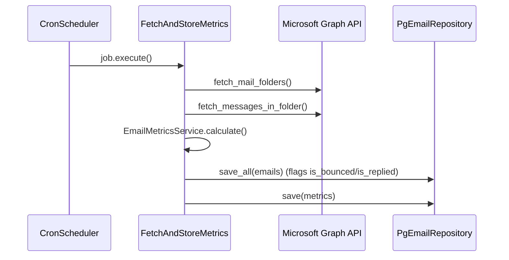

# Email Metrics 📊

[](https://www.python.org/)　
[](https://www.postgresql.org/)　
[](https://learn.microsoft.com/graph/)　
[](#license)

> **Resumo curto**
> Coleta métricas de campanhas de e-mail (contagem, entregas, bounces, respostas) direto da Microsoft Graph API, grava tudo em PostgreSQL e gera logs estruturados para observabilidade.

---

## Índice <!-- GitHub gera paginação/ancoras automaticamente -->

1. [Visão geral](#visão-geral)
2. [Fluxo de funcionamento](#fluxo-de-funcionamento)
3. [Estrutura de diretórios](#estrutura-de-diretórios)
4. [Variáveis de ambiente](#variáveis-de-ambiente)
5. [Execução rápida](#execução-rápida)
6. [Modo leigo × Modo técnico](#modo-leigo--x--modo-técnico)
7. [Manual técnico](#manual-técnico)
8. [Consultas úteis](#consultas-úteis)
9. [Roadmap / TODO](#roadmap--todo)
10. [Contribuição](#contribuição)
11. [Licença](#license)

---

## Visão geral

| **Componente**           | **Responsabilidade**                                                                 |
| ------------------------ | ------------------------------------------------------------------------------------ |
| **GraphApiClient**       | Pega pastas e mensagens via Microsoft Graph com retries, timeout e paginação segura. |
| **EmailMetricsService**  | Detecta *bounces* (falha de entrega) e *replies* por conversa; calcula taxas.        |
| **PgEmailRepository**    | UPSERT de e-mails brutos (`emails`) e métricas diárias (`metrics`) em PostgreSQL.    |
| **FetchAndStoreMetrics** | Orquestra: coleta → filtra → calcula métricas → persiste tudo.                       |
| **CronScheduler**        | Roda o fluxo periodicamente (ou só uma vez, via `--once`).                           |
| **Structlog**            | Logs JSON uniformes para Loki/ELK.                                                   |

---

## Fluxo de funcionamento



---

## Estrutura de diretórios

```
.
├── adapters          # Integrações externas (Graph, SQLAlchemy, Scheduler)
├── application       # Casos de uso
├── domain            # Entidades e serviços de domínio
├── ports             # Interfaces (hexagonal)
├── config            # Settings, logging, env helper
└── infrastructure    # Docker, compose, migrations (quando houver)
```

---

## Variáveis de ambiente

| Chave                        | Exemplo                                     | Descrição                                |
| ---------------------------- | ------------------------------------------- | ---------------------------------------- |
| `TENANT_ID`                  | `463357ee-…`                                | Azure AD Tenant                          |
| `CLIENT_ID`                  | `318b9b0a-…`                                | App registration (Graph)                 |
| `CLIENT_SECRET`              | `…`                                         | Segredo do app                           |
| `EMAIL_ACCOUNT`              | `campanha@acme.com`                         | Conta a ser analisada                    |
| `SENT_FOLDER_NAME`           | `itens enviados`                            | Nome (case-insensitive) da pasta enviada |
| `SUBJECT_FILTER`             | `OPORTUNIDADE DE ACORDO,PROPOSTA DE ACORDO` | Lista separada por vírgula               |
| `IGNORED_RECIPIENT_PATTERNS` | `@empresaX,@spam`                           | Fragmentos de e-mail a ignorar           |
| `POSTGRES_*`                 | …                                           | Host, porta, user, senha, db             |

---

## Execução rápida

### 1 – Docker Compose

```bash
cp .env.example .env         # preencha credenciais
docker compose up --build
```

Logs aparecem em JSON no stdout; basta enviar ao Loki ou Stackdriver.

### 2 – Somente Python (Poetry)

```bash
poetry install
poetry run python -m application.main --once
```

---

## Modo leigo × Modo técnico

| Modo leigo                                                                                                          | Modo técnico                                                                                                           |
| ------------------------------------------------------------------------------------------------------------------- | ---------------------------------------------------------------------------------------------------------------------- |
| O robô entra na conta de e-mail, conta quantas mensagens foram enviadas e quantas deram erro ou receberam resposta. | Integração OAuth2 Client Credentials → Graph `/mailFolders` e `/messages` → análise de *threads* por `conversationId`. |
| Ele grava esses números num banco para você acompanhar se a campanha deu certo.                                     | Tabelas `emails` (row-level) e `metrics` (daily snapshot) com UPSERT.                                                  |
| A cada X minutos ele repete a operação sozinho.                                                                     | `CronScheduler` aciona `FetchAndStoreMetrics`, configurável via CLI ou container env.                                  |

---

## Manual técnico

<details>
<summary>🛠️ Clique para detalhes</summary>

### Regras de domínio

* **Bounce** = qualquer mensagem na conversa cujo `subject` combine `undeliverable|falha de entrega|delivery has failed` **ou** remetente contenha `postmaster|mailer-daemon`.
* **Reply** = mensagem na conversa cujo `from.address` ≠ `EMAIL_ACCOUNT`, desde que não seja *bounced*.

### Persistência

```sql
CREATE TABLE emails (
    id              uuid        PRIMARY KEY,
    message_id      text,
    subject         text,
    sent_datetime   timestamptz,
    is_read         boolean,
    conversation_id text,
    has_attachments boolean,
    is_bounced      boolean NOT NULL DEFAULT false,
    is_replied      boolean NOT NULL DEFAULT false
);

CREATE TABLE metrics (
    date            date PRIMARY KEY,
    total_sent      int  NOT NULL,
    total_delivered int  NOT NULL,
    total_bounced   int  NOT NULL,
    total_replied   int  NOT NULL,
    total_no_reply  int  NOT NULL,
    delivery_rate   int  NOT NULL,   -- ×10 000
    reply_rate      int  NOT NULL
);
```

### Logs

```
{
  "timestamp":"2025-07-03T21:35:50Z",
  "service":"email_metrics",
  "event":"metrics.calc.success",
  "total_sent":3097,
  "total_bounced":12,
  ...
}
```

### Endpoints (futuros)

* `/metrics` – export Prometheus
* `/emails/bounced` – REST/GraphQL listagem

</details>

---

## Consultas úteis

```sql
-- Últimos bounces
SELECT subject, sent_datetime, message_id
FROM emails
WHERE is_bounced
ORDER BY sent_datetime DESC;

-- Taxa de abertura/retorno por dia
SELECT
  date,
  delivery_rate / 100.0  AS delivery_pct,
  reply_rate    / 100.0  AS reply_pct
FROM metrics
ORDER BY date DESC;
```
---

## License

GNU © 2025 — livre para uso e modificação.
